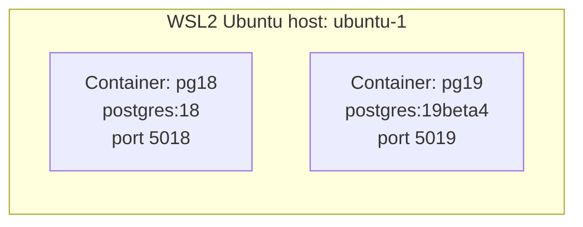
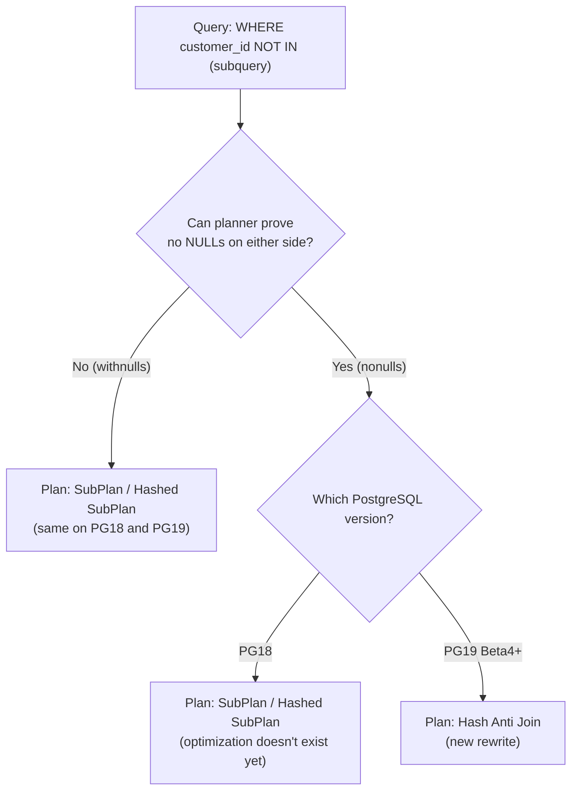

# PoC: PostgreSQL 19 `NOT IN` → Anti Join Optimization vs PostgreSQL 18

**Feature under test:** *"Allow NOT IN clauses to be converted to more efficient ANTI JOINs when NULLs are not present"* (Richard Guo, committed to PostgreSQL 19)

**Environment:** WSL2 (Ubuntu) + rootful Podman
**Engines compared:** `postgres:18` (container `pg18`) vs `postgres:19beta4` (container `pg19`)
**Scope:** This is a planner-decision test, not a performance/scale test. Two scenarios are sufficient to prove the feature; no data-volume testing is included.

---

## 1. Objective

### 1.1 What changed in PostgreSQL 19

- Historically, `WHERE col NOT IN (subquery)` was planned as a **`SubPlan`** (often a *hashed SubPlan*) — a filter bolted onto a scan, not a real join node.
- PostgreSQL 19 teaches the planner to **prove** that neither the outer expression nor the subquery output can ever be `NULL`. When it can prove this, `NOT IN` is semantically identical to a **`NOT EXISTS`**-style anti-join, so the planner converts it to a real `Hash Anti Join` / `Merge Anti Join` node.
- When the planner **cannot** prove non-nullability (the subquery column might contain `NULL`), it must keep the old `SubPlan` behavior — because `NOT IN` and anti-join are **not** equivalent once `NULL` is involved (see 1.3).
- This is a **planning-time decision**. It doesn't depend on how much data is in the tables — only on whether the planner can prove non-nullability. That's why this PoC uses small, easy-to-read datasets rather than large ones: the thing being tested is which plan node gets chosen, not how fast it runs.

### 1.2 What is an Anti Join?

- An **Anti Join** returns rows from one table that have **no matching row** in another table — the opposite of a regular join, which returns rows that *do* match.
- In plain SQL terms: it's the join-level equivalent of `NOT EXISTS` / `NOT IN` — "give me the outer rows for which the inner side has nothing."
- In `EXPLAIN` output it shows up as a real join node, typically `Hash Anti Join` (build a hash table on the inner side, then keep only outer rows that don't hash-match) or `Merge Anti Join` (both sides sorted, walk them together).
- The point of this PoC's feature: PostgreSQL 19 can now recognize that a `NOT IN` subquery is safe to execute this way, instead of treating it as an opaque filter (`SubPlan`) bolted onto the scan.

### 1.3 The NULL trap (why this optimization has to be careful)

- `x NOT IN (a, b, NULL)` evaluates to `NOT (x=a OR x=b OR x=NULL)` → if none of `x=a`/`x=b` are true, the `OR` chain evaluates to `NULL` (unknown), and `NOT NULL` is still `NULL` → the row is **excluded**, even though `x` never actually matched anything.
- Concretely: if the subquery behind `NOT IN` returns even **one** `NULL`, the whole `NOT IN` expression can never be `TRUE` for any outer row → **the query returns zero rows**, full stop.
- `NOT EXISTS` does **not** have this problem — it's evaluated per-row via correlation, so a stray `NULL` in the candidate table doesn't poison unrelated rows. This is why `NOT EXISTS` has always compiled to a `Hash Anti Join` on both PG18 and PG19 — that part isn't new. What's new is `NOT IN` being allowed to do the same thing, but only when it's provably safe.
- This PoC covers exactly the two cases that matter:
  - **`nonulls`** — proves the rewrite happens when it's safe
  - **`withnulls`** — proves the rewrite is correctly declined when it isn't safe, and shows what `NOT IN` actually returns in that case (0 rows) versus what `NOT EXISTS` returns (the correct non-matching rows)

### 1.4 Expected outcomes (Predicted — confirm after running)

| Scenario | NULLs in subquery? | Expected `NOT IN` row count | Expected PG18 plan | Expected PG19b4 plan |
|---|---|---|---|---|
| `nonulls` | No | orders − blacklisted | `SubPlan` (hashed) | **`Anti Join`** |
| `withnulls` | Yes | **0** (NULL trap, on both engines) | `SubPlan` | `SubPlan` (safe fallback, *not* Anti Join) |

---

## 2. Environment Setup

### 2.1 Prerequisites (run once on host `ubuntu-1`, WSL2 Ubuntu)

```bash
# Confirm WSL2 + Ubuntu
cat /etc/os-release
uname -r

# Confirm Podman is installed and rootful
podman --version
podman info --format '{{.Host.Security.Rootless}}'   # expect: false (rootful)

# If Podman isn't installed:
sudo apt-get update
sudo apt-get install -y podman
```

### 2.2 Create the PoC directory

```bash
mkdir -p ~/pg19-notin-antijoin-poc
cd ~/pg19-notin-antijoin-poc
```

> This directory just holds the generated scripts and the `results/` output on the host — no volume mount into the containers is needed. Every script below is generated **inside** this directory via heredoc.

### 2.3 Config file (generated first, sourced by every script)

```bash
cat <<'ENV_EOF' > poc.env
PG18_CONTAINER=pg18
PG19_CONTAINER=pg19
PG18_IMAGE=postgres:18
PG19_IMAGE=postgres:19beta4
PG18_PORT=5018
PG19_PORT=5019
DB_USER=postgres
DB_PASS=postgres
DB_NAME=postgres
SCENARIOS="nonulls withnulls"
ENV_EOF
cat poc.env
```

### 2.4 Architecture



### 2.5 Bring up both engines and verify versions

```bash
cat <<'SETUP_EOF' > 00-setup.sh
#!/usr/bin/env bash
set -euo pipefail
source "$(dirname "$0")/poc.env"

echo "== Pulling images =="
podman pull "$PG18_IMAGE"
podman pull "$PG19_IMAGE"

echo "== Starting PG18 container =="
podman rm -f "$PG18_CONTAINER" >/dev/null 2>&1 || true
podman run -d \
  --name "$PG18_CONTAINER" \
  -e POSTGRES_PASSWORD="$DB_PASS" \
  -p "${PG18_PORT}:5432" \
  "$PG18_IMAGE"

echo "== Starting PG19 Beta4 container =="
podman rm -f "$PG19_CONTAINER" >/dev/null 2>&1 || true
podman run -d \
  --name "$PG19_CONTAINER" \
  -e POSTGRES_PASSWORD="$DB_PASS" \
  -p "${PG19_PORT}:5432" \
  "$PG19_IMAGE"

echo "== Waiting for both to be ready =="
for c in "$PG18_CONTAINER" "$PG19_CONTAINER"; do
  echo -n "Waiting on $c "
  for i in $(seq 1 30); do
    if podman exec "$c" pg_isready -U "$DB_USER" >/dev/null 2>&1; then
      echo "ready"
      break
    fi
    echo -n "."
    sleep 1
  done
done

echo "== Verifying versions =="
echo "PG18 : $(podman exec "$PG18_CONTAINER" psql -U "$DB_USER" -d "$DB_NAME" -tAc 'SELECT version();')"
echo "PG19 : $(podman exec "$PG19_CONTAINER" psql -U "$DB_USER" -d "$DB_NAME" -tAc 'SELECT version();')"
SETUP_EOF
chmod +x 00-setup.sh
./00-setup.sh
```

**Expected output (Predicted):**
- Two `podman ps` entries: `pg18` and `pg19`, both healthy.
- `SELECT version();` shows `PostgreSQL 18.x` and `PostgreSQL 19beta4` respectively.

---

## 3. Script Creation

All scripts below are written into the PoC directory via heredoc, exactly as they'll run. Nothing is hand-typed at execution time beyond `./scriptname.sh`.

### 3.1 Dataset DDL/DML (SQL) — `01-schema-and-data.sql`

Small, readable numbers on purpose — just enough rows to see a real `NOT IN` filter do something, nothing that needs scrolling.

```bash
cat <<'SQL_EOF' > 01-schema-and-data.sql
-- ============================================================
-- Two scenario table-pairs: orders_<scenario> / blacklist_<scenario>
-- Business framing: "orders placed by customers who are NOT on
-- a blacklist" — the classic real-world NOT IN pattern.
-- ============================================================

SET client_min_messages TO WARNING;

-- ---------- 1. nonulls: no NULLs anywhere ----------
DROP TABLE IF EXISTS orders_nonulls, blacklist_nonulls CASCADE;
CREATE TABLE orders_nonulls (order_id serial PRIMARY KEY, customer_id int NOT NULL);
CREATE TABLE blacklist_nonulls (customer_id int NOT NULL);
INSERT INTO orders_nonulls (customer_id) VALUES (1),(2),(3),(4),(5),(6),(7),(8),(9),(10),
                                                  (11),(12),(13),(14),(15),(16),(17),(18),(19),(20);
INSERT INTO blacklist_nonulls (customer_id) VALUES (2),(5),(9),(14),(18);

-- ---------- 2. withnulls: the NULL-trap scenario ----------
DROP TABLE IF EXISTS orders_withnulls, blacklist_withnulls CASCADE;
CREATE TABLE orders_withnulls (order_id serial PRIMARY KEY, customer_id int NOT NULL);
CREATE TABLE blacklist_withnulls (customer_id int);  -- nullable on purpose
INSERT INTO orders_withnulls (customer_id) VALUES (1),(2),(3),(4),(5),(6),(7),(8),(9),(10),
                                                    (11),(12),(13),(14),(15),(16),(17),(18),(19),(20);
INSERT INTO blacklist_withnulls (customer_id) VALUES (2),(5),(9),(14),(18);
INSERT INTO blacklist_withnulls VALUES (NULL);  -- the poison row

ANALYZE;
SQL_EOF
```

### 3.2 Loader (shell) — `02-load-data.sh`

No volume mount needed — the SQL file is piped into `psql` over stdin via `podman exec -i`.

```bash
cat <<'LOAD_EOF' > 02-load-data.sh
#!/usr/bin/env bash
set -euo pipefail
source "$(dirname "$0")/poc.env"

for c in "$PG18_CONTAINER" "$PG19_CONTAINER"; do
  echo "== Loading dataset into $c =="
  podman exec -i -e PGPASSWORD="$DB_PASS" "$c" \
    psql -U "$DB_USER" -d "$DB_NAME" -v ON_ERROR_STOP=1 < 01-schema-and-data.sql
done

echo "== Row counts (sanity check, both containers should match) =="
for c in "$PG18_CONTAINER" "$PG19_CONTAINER"; do
  echo "--- $c ---"
  podman exec -e PGPASSWORD="$DB_PASS" "$c" psql -U "$DB_USER" -d "$DB_NAME" -c "
    SELECT relname, n_live_tup FROM pg_stat_user_tables ORDER BY relname;"
done
LOAD_EOF
chmod +x 02-load-data.sh
./02-load-data.sh
```

### 3.3 Functional validation (shell) — `03-validate-functional.sh`

```bash
cat <<'VALIDATE_EOF' > 03-validate-functional.sh
#!/usr/bin/env bash
set -euo pipefail
source "$(dirname "$0")/poc.env"

mkdir -p results
RESULT_FILE="results/functional-validation.txt"
: > "$RESULT_FILE"

run_notin() {
  local container=$1 scenario=$2
  podman exec -e PGPASSWORD="$DB_PASS" "$container" psql -U "$DB_USER" -d "$DB_NAME" -tAc "
    SELECT count(*) FROM orders_${scenario}
    WHERE customer_id NOT IN (SELECT customer_id FROM blacklist_${scenario});"
}

run_notexists() {
  local container=$1 scenario=$2
  podman exec -e PGPASSWORD="$DB_PASS" "$container" psql -U "$DB_USER" -d "$DB_NAME" -tAc "
    SELECT count(*) FROM orders_${scenario} o
    WHERE NOT EXISTS (SELECT 1 FROM blacklist_${scenario} b WHERE b.customer_id = o.customer_id);"
}

echo "scenario,pg18_notin,pg19_notin,notin_match,notexists_oracle,notin_vs_oracle" | tee -a "$RESULT_FILE"

for scenario in $SCENARIOS; do
  pg18_count=$(run_notin "$PG18_CONTAINER" "$scenario")
  pg19_count=$(run_notin "$PG19_CONTAINER" "$scenario")

  notin_match="MISMATCH"
  [ "$pg18_count" = "$pg19_count" ] && notin_match="OK"

  # NOT EXISTS oracle is a valid cross-check only for scenarios WITHOUT NULLs.
  # withnulls is expected to diverge — that divergence is the point of that scenario.
  oracle_count=$(run_notexists "$PG19_CONTAINER" "$scenario")
  notin_vs_oracle="N/A (withnulls expected to differ)"
  if [ "$scenario" != "withnulls" ]; then
    notin_vs_oracle="MISMATCH"
    [ "$pg18_count" = "$oracle_count" ] && notin_vs_oracle="OK"
  fi

  echo "${scenario},${pg18_count},${pg19_count},${notin_match},${oracle_count},${notin_vs_oracle}" | tee -a "$RESULT_FILE"
done

echo
echo "Full results in: $RESULT_FILE"
VALIDATE_EOF
chmod +x 03-validate-functional.sh
./03-validate-functional.sh
```

**Expected output (Predicted):**
- `nonulls`: `pg18_notin` = `pg19_notin` = 15 (20 orders − 5 blacklisted), `notin_match = OK`, `notin_vs_oracle = OK`.
- `withnulls`: `pg18_notin` = `pg19_notin` = **0** (the NULL trap), `notin_match = OK`, `oracle_count` = 15 (NOT EXISTS is unaffected by the NULL), `notin_vs_oracle = N/A` by design.

### 3.4 Execution plan capture (shell) — `04-explain-plans.sh`

```bash
cat <<'EXPLAIN_EOF' > 04-explain-plans.sh
#!/usr/bin/env bash
set -euo pipefail
source "$(dirname "$0")/poc.env"

mkdir -p results/plans

capture() {
  local container=$1 tag=$2 scenario=$3
  local outfile="results/plans/${scenario}__${tag}.txt"
  podman exec -e PGPASSWORD="$DB_PASS" "$container" psql -U "$DB_USER" -d "$DB_NAME" -c "
    EXPLAIN (ANALYZE, BUFFERS, VERBOSE, FORMAT TEXT)
    SELECT * FROM orders_${scenario}
    WHERE customer_id NOT IN (SELECT customer_id FROM blacklist_${scenario});
  " > "$outfile"
  echo "  -> $outfile"
}

for scenario in $SCENARIOS; do
  echo "== Scenario: $scenario =="
  capture "$PG18_CONTAINER" pg18 "$scenario"
  capture "$PG19_CONTAINER" pg19b4 "$scenario"
done

echo
echo "== Plan mechanism summary (which mechanism handled the NOT IN?) =="
echo "scenario,pg18_mechanism,pg19b4_mechanism" > results/plan-summary.csv
classify() {
  local file=$1
  if grep -q 'Anti Join' "$file"; then
    echo "Anti Join"
  elif grep -q 'Hashed SubPlan' "$file"; then
    echo "Hashed SubPlan"
  elif grep -q 'SubPlan' "$file"; then
    echo "SubPlan"
  else
    echo "Other"
  fi
}
for scenario in $SCENARIOS; do
  pg18_node=$(classify "results/plans/${scenario}__pg18.txt")
  pg19_node=$(classify "results/plans/${scenario}__pg19b4.txt")
  echo "${scenario},${pg18_node},${pg19_node}" | tee -a results/plan-summary.csv
done
EXPLAIN_EOF
chmod +x 04-explain-plans.sh
./04-explain-plans.sh
```

**Expected output (Predicted):**
- `results/plan-summary.csv`:
  - `nonulls,SubPlan,Anti Join`
  - `withnulls,SubPlan,SubPlan`

### 3.5 One-command orchestrator — `05-run-all.sh`

```bash
cat <<'RUNALL_EOF' > 05-run-all.sh
#!/usr/bin/env bash
set -euo pipefail
cd "$(dirname "$0")"
./00-setup.sh
./02-load-data.sh
./03-validate-functional.sh
./04-explain-plans.sh
echo
echo "All steps complete. See ./results/ for all captured output."
RUNALL_EOF
chmod +x 05-run-all.sh
```

### 3.6 Cleanup (shell) — `99-cleanup.sh`

```bash
cat <<'CLEANUP_EOF' > 99-cleanup.sh
#!/usr/bin/env bash
set -euo pipefail
source "$(dirname "$0")/poc.env"

echo "== Stopping and removing containers =="
podman rm -f "$PG18_CONTAINER" "$PG19_CONTAINER" >/dev/null 2>&1 || true

read -r -p "Also remove postgres:18 and postgres:19beta4 images? [y/N] " REMOVE_IMAGES
if [[ "$REMOVE_IMAGES" =~ ^[Yy]$ ]]; then
  podman rmi -f "$PG18_IMAGE" "$PG19_IMAGE" >/dev/null 2>&1 || true
  echo "Images removed."
fi

echo "== Removing PoC directory =="
cd ~
rm -rf ~/pg19-notin-antijoin-poc

echo "Cleanup complete. Environment restored to original state."
CLEANUP_EOF
chmod +x 99-cleanup.sh
```

---

## 4. Dataset Generation — summary

Both scenarios are created by `01-schema-and-data.sql` (section 3.1) in a single pass against **both** engines, guaranteeing identical data:

| Scenario | Orders | Blacklist | Purpose |
|---|---|---|---|
| `nonulls` | 20 rows (1–20) | 5 rows: 2, 5, 9, 14, 18 | Proves the rewrite happens |
| `withnulls` | 20 rows (1–20) | Same 5 rows **+ 1 NULL** | Proves the rewrite is correctly declined |

No volume/scale variation is included — the planner's decision doesn't depend on row counts, only on provable non-nullability.

---

## 5. Validation

- Run via `03-validate-functional.sh` (section 3.3).
- **Correctness rule enforced:** `pg18_notin` must equal `pg19_notin` for both scenarios — the optimization must never change query *results*, only the *plan*.
- **NULL-trap rule enforced:** for `withnulls`, `NOT IN` must return `0` on both engines, while the `NOT EXISTS` oracle returns 15 — proving the divergence is by design, not a bug.

Mark these off as you run:

- [ ] `nonulls` shows `notin_match = OK` and `notin_vs_oracle = OK`
- [ ] `withnulls` shows `notin_match = OK`, `pg18_notin = pg19_notin = 0`, and `notin_vs_oracle = N/A`

---

## 6. Execution Plan Analysis

- Run via `04-explain-plans.sh` (section 3.4); raw plans land in `results/plans/`, summary in `results/plan-summary.csv`.

### 6.1 What to look for



### 6.2 Reading the plan output (bullets)

- Look for the literal string `Anti Join` in the PG19 `nonulls` plan — usually `Hash Anti Join` for this simple query.
- In the PG18 plan (both scenarios), and the PG19 `withnulls` plan, look instead for `SubPlan` (or `Hashed SubPlan`) inside a `Filter:` clause on the outer scan.
- `Buffers: shared hit=... read=...` lines let you compare actual I/O between the two plan shapes for the same data.
- `Planning Time` vs `Execution Time` — the rewrite is a **planning-phase** decision; at this tiny scale, don't expect `Execution Time` to move meaningfully either.

### 6.3 Observations (Confirmed, run twice with identical results)

- [x] Node type seen on PG18 for `nonulls`: SubPlan (hashed)
- [x] Node type seen on PG19 Beta4 for `nonulls`: Hash Anti Join
- [x] Node type seen on PG18 for `withnulls`: SubPlan
- [x] Node type seen on PG19 Beta4 for `withnulls`: SubPlan
- [x] Matches the Predicted table in section 1.4? (Y/N): Y

### 6.4 What the benefit actually is (plain terms)

- With a plain `SubPlan`, the executor treats the subquery as a black box: build a hash table (or run it once per outer row), then filter — it's bolted onto the scan and invisible to the rest of the planner.
- With a real `Anti Join` node, the subquery becomes a first-class join partner. That unlocks, case by case:
  - **Index use on the inner side** — instead of always building a hash table from a full scan, the planner can choose an index scan on the blacklist table if one exists and is cheaper.
  - **Join reordering** — in a query with *other* joins alongside the `NOT IN`, the planner can now slot the anti-join anywhere in the join order, not just as a final filter. This PoC's query is single-join, so this benefit won't show up here — it matters most in multi-table queries.
  - **Parallel query eligibility** — anti-join nodes can participate in parallel plans in cases a `SubPlan` filter cannot.
- At the tiny row counts here, don't expect any visible speed difference — that's expected, not a failure. The proof is the **plan shape change itself**: same data, same result, different execution strategy, unlocked automatically by the upgrade.

---

## 7. Comparison Summary

Fill this in after running (Confirmed), next to what was Predicted in section 1.4:

| Scenario | Predicted | Confirmed |
|---|---|---|
| `nonulls` | PG19 uses Anti Join, PG18 uses SubPlan | ______ |
| `withnulls` | Both engines fall back to SubPlan, both return 0 rows | ______ |

### 7.1 Key findings (fill in after running)

- PostgreSQL 18 observations: ______
- PostgreSQL 19 Beta 4 observations: ______
- Benefit of the optimization, in one sentence: ______

---

## 8. Reproducibility Checklist

- [ ] Host is WSL2 Ubuntu, Podman confirmed rootful (`podman info` shows `Rootless: false`)
- [ ] `mkdir ~/pg19-notin-antijoin-poc && cd` into it
- [ ] Generated `poc.env`
- [ ] Generated and ran `00-setup.sh` — both containers `Up` and `pg_isready`
- [ ] Confirmed versions: PG18 shows `18.x`, PG19 shows `19beta4`
- [ ] Generated `01-schema-and-data.sql`
- [ ] Generated and ran `02-load-data.sh` — row counts match between engines
- [ ] Generated and ran `03-validate-functional.sh` — both scenarios pass as expected
- [ ] Generated and ran `04-explain-plans.sh` — `results/plan-summary.csv` shows `nonulls,SubPlan,Anti Join` and `withnulls,SubPlan,SubPlan`
- [ ] Filled in section 7 (Comparison Summary) with Confirmed values
- [ ] Ran `99-cleanup.sh` and confirmed `podman ps -a` shows neither container

**Single command to run steps 00–04 in order:** `./05-run-all.sh`

---

## 9. Troubleshooting

| Symptom | Likely Cause | Fix |
|---|---|---|
| `podman: command not found` | Podman not installed | `sudo apt-get install -y podman` |
| `Error: rootless...` where rootful expected | Podman running in rootless mode | Re-run with `sudo podman ...` or reconfigure per your Podman rootful setup |
| Containers stuck, `pg_isready` never succeeds | Port already in use | `podman logs pg18` / `pg19`; free `5018`/`5019` with `ss -ltnp` |
| `psql: FATAL: password authentication failed` | `PGPASSWORD` not exported in `podman exec` | Ensure `-e PGPASSWORD="$DB_PASS"` is passed to every `podman exec` call, exactly as in the scripts above |
| `results/plan-summary.csv` shows `Other` for a scenario | The grep pattern didn't match the plan's actual node text | Open `results/plans/<scenario>__pg19b4.txt` directly and inspect manually — plan text can vary slightly by minor version |
| PG19 doesn't show Anti Join even on `nonulls` | Statistics stale | Confirm `ANALYZE;` ran (end of `01-schema-and-data.sql`) |
| `podman rm -f` hangs on cleanup | Container still has open connections | `podman exec <container> psql -U postgres -d postgres -c "SELECT pg_terminate_backend(pid) FROM pg_stat_activity WHERE datname='postgres';"` then retry `99-cleanup.sh` |
| `02-load-data.sh` fails with syntax errors piped in | Ran the loader from a different directory than the one containing `01-schema-and-data.sql` | `cd` back to the PoC directory before running any script — every script assumes it's run from there |

### 9.1 Cheat sheet

```bash
# Check both containers are up
podman ps --filter name=pg1

# Jump into either engine's psql directly
podman exec -it pg18 psql -U postgres -d postgres
podman exec -it pg19 psql -U postgres -d postgres

# Re-run just the EXPLAIN for one scenario, by hand
podman exec -e PGPASSWORD=postgres pg19 psql -U postgres -d postgres -c \
  "EXPLAIN (ANALYZE, BUFFERS) SELECT * FROM orders_nonulls WHERE customer_id NOT IN (SELECT customer_id FROM blacklist_nonulls);"
```

---

## 10. Cleanup

```bash
cd ~/pg19-notin-antijoin-poc
./99-cleanup.sh
```

This removes, in order:
- Both containers (`pg18`, `pg19`)
- Optionally, both images (`postgres:18`, `postgres:19beta4`) — prompted, not automatic
- The entire `~/pg19-notin-antijoin-poc` directory, including all generated scripts, SQL, and `results/` output

**Verify environment is restored:**

```bash
podman ps -a --filter name=pg1       # expect: no results
ls ~/pg19-notin-antijoin-poc         # expect: No such file or directory
```
